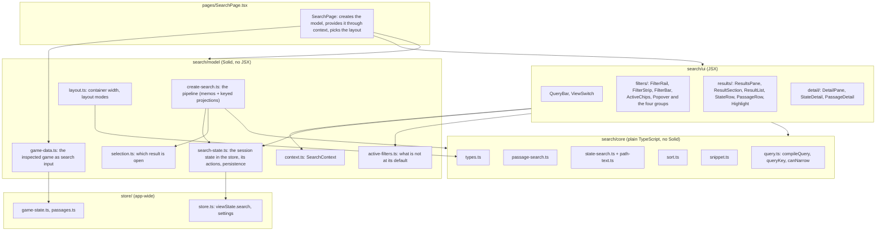

# Search: architecture

Three layers. Each only depends on the one(s) above it in the diagram.

## Where things live

| Folder     | Contents                                                                            | Why it is separate                                                                     |
| ---------- | ----------------------------------------------------------------------------------- | -------------------------------------------------------------------------------------- |
| `core/`    | Compiling the query, searching passages and state, sorting, snippets, the hit types | No Solid imports: unit-tested in node, and usable from a worker if that is ever wanted |
| `model/`   | The reactive pipeline, the session state and its actions, selection, layout modes   | No JSX: tested with `createRoot` and `flush`                                           |
| `ui/`      | Components                                                                          | Only reads the model through context and the actions in `search-state.ts`              |
| `types.ts` | Types of the model and UI (`SearchData`, `SearchModel`, `FilterGroup`, ...)         | Types that are shared go in `core/types.ts` (no Solid) or here                         |

## Shared pieces outside `search/`

- `utils/create-virtualizer.ts`: the virtualizer adapter, with `reconcileBy: 'key'` so a row follows its hit.
- `ui/code`: the passage editor (opens at the first match and marks the matches; syntax highlighting is held back for long passages, see the setting `editor.disableHighlighting`).
- `ui/display/PrettyPath.tsx`: the coloured path in state rows; takes `ranges` to mark matches.
- `ui/util/range-highlight.ts`: marks ranges of text with the CSS Custom Highlight API (`::highlight(search-match)`), used by `Highlight`, `PrettyPath` and the editor.

## The data the search reads

`createSearch(data: SearchData)` does not import the stores. It is given:

| Field                | Meaning                                                              |
| -------------------- | -------------------------------------------------------------------- |
| `passages()`         | The passages (a signal; replaced when they are reloaded or saved)    |
| `stateVersion()`     | Changes whenever the game state does, so the state is searched again |
| `getState()`         | The state as plain data. Reading it is not tracked                   |
| `getLastChange(key)` | When a path last changed (for "recently changed" sorting)            |

`game-data.ts` provides the real game; tests provide small fakes.
