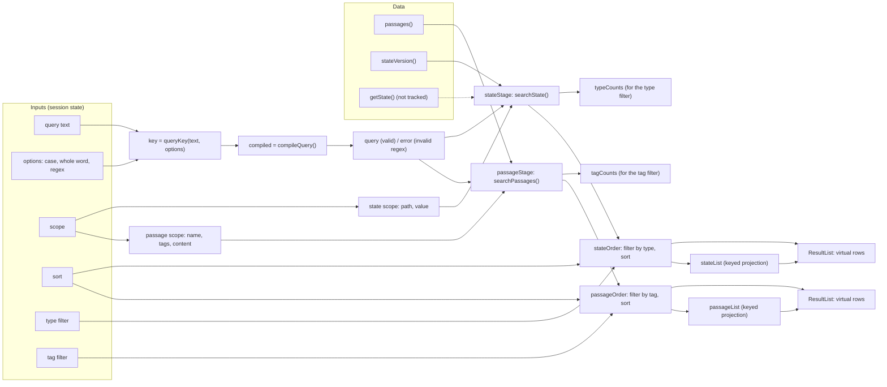

# Search: data flow

`createSearch` (in `model/create-search.ts`) is a pipeline of steps. Each step only looks at what it depends on, so changing one input re-runs as little as possible.

## What re-runs when something changes

| Changes                                      | Passages searched again       | State searched again | Filtered and sorted again |
| -------------------------------------------- | ----------------------------- | -------------------- | ------------------------- |
| The query text or an option                  | yes (narrowing when possible) | yes                  | yes                       |
| A passage scope toggle (name, tags, content) | yes                           | no                   | yes                       |
| A state scope toggle (path, value)           | no                            | yes                  | yes                       |
| The passages (reload, save)                  | yes                           | no                   | yes                       |
| The game state (a poll found a change)       | no                            | yes                  | state only                |
| A tag filter                                 | no                            | no                   | passages only             |
| A type filter                                | no                            | no                   | state only                |
| A sort                                       | no                            | no                   | that section only         |

Switching an option on and back off before the next flush searches nothing: the query key is the same, and a memo whose value did not change does not notify what depends on it.

## Narrowing

When the query only got longer (`a` → `aa`), what matches the new query is a subset of what matched the old one, so the passage search starts from the previous hits' passages instead of from all of them. `canNarrow` allows this only for plain text with the same case option: a whole word or a regex that matches `aa` does not have to match `a`, so those start over. The previous passages are only used if the passage list and the passage scope are unchanged.

## Two orders, two projections

For each section the pipeline produces two things from the same sorted, filtered hits:

- the **order**: a plain array that is new each time the results change. The virtualizer uses it to learn that the keys at its positions may have changed.
- the **list**: a `createProjection` keyed by `hit.key`. A hit that is still in the results after a change is the same object, so its row keeps its DOM and is not rebuilt. The rows read from this.

## Hits are plain data

A hit holds the key, where the match is (ranges) and what is needed to show a row; it does not hold the passage. The first match in the content is stored (to make a snippet), but not how many there are: counting every match costs as much as the search, so a row counts the matches of its own passage, and the "most matches" sort counts only while it is selected.

State is searched with an iterative walk (functions and dates are not looked into). A key only counts for objects and maps, a value only for strings, numbers and booleans, and numbers are matched as the text they are written as.
