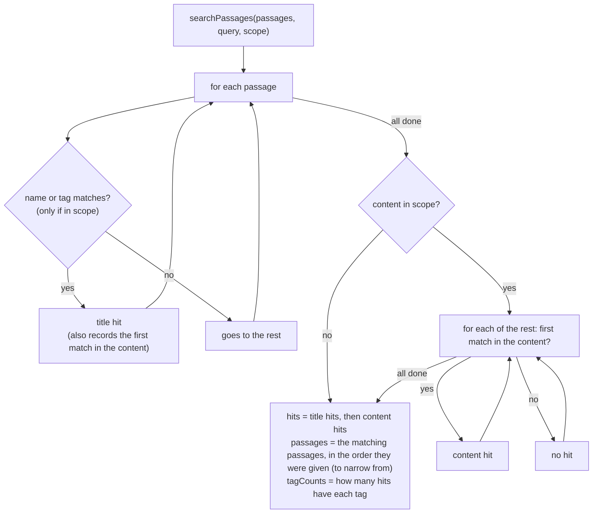
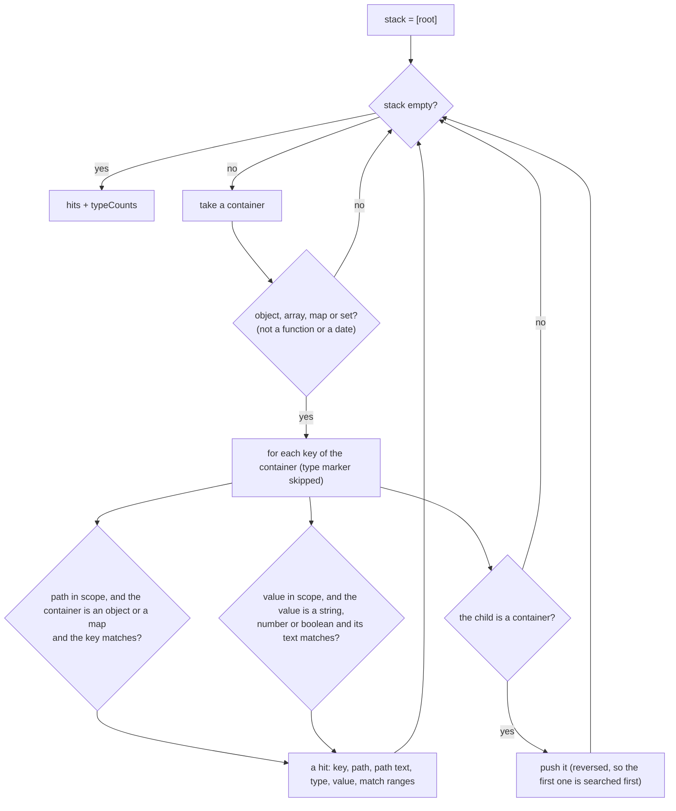
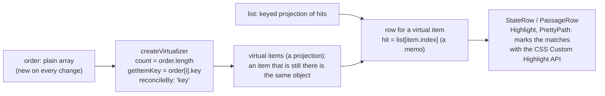
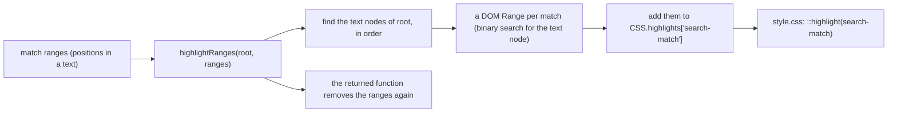
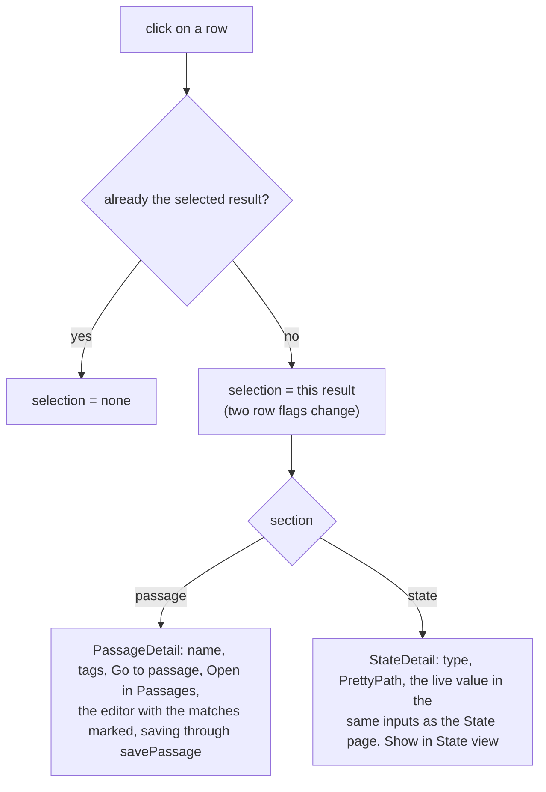

# Search: the parts in detail (level 4)

Step-by-step diagrams of the parts that are not obvious from the code layout.

## Searching the passages (`core/passage-search.ts`)

Two passes: the cheap one first (names and tags), the content (almost all of the cost) only for the rest. The order of the hits is the order of "best match": name or tag matches first.

## Searching the state (`core/state-search.ts`)

An iterative walk (no recursion), in the order of the state. The path text is built while walking, so a hit has what the row shows.

## From hits to rows (`ResultList`)

Only the rows in view exist. A row belongs to a **hit**, not to a position.

When the query changes, a hit that is still in the results keeps its row (nothing is written to the DOM if its matches did not change), an entering hit gets a new row, and a leaving hit loses its row. A test (`ResultList.test.tsx`) checks that a change that leaves the hits as they are produces no DOM mutations at all.

## Marking matches

The markup is never changed to show a match: the text is one text node (or the pieces `PrettyPath` makes), and the highlight is drawn over it. The editor uses the same function for the matches in a passage, and scrolls to the first one.

## Opening a result (`DetailPane`)

