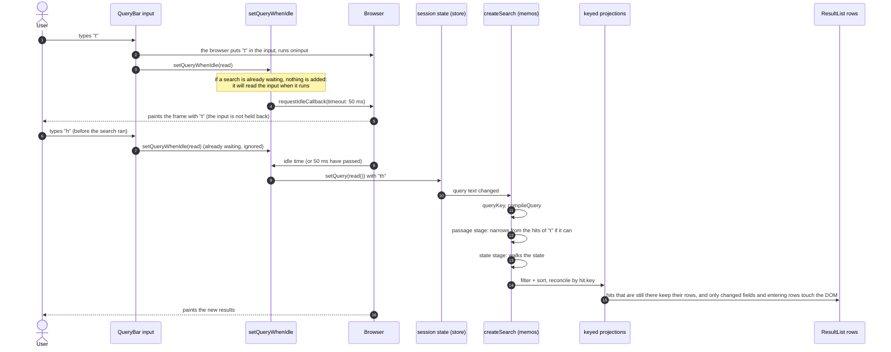

# Search: what happens when a letter is typed (level 4)

The goal is that the letter shows up at once, however slow the machine, and that the results follow as soon as possible. A search is therefore not run inside the key press.

## Why it is built like this

- **Not in the key press.** A search costs 1–10 ms on a fast machine but 50–150 ms at 4–6× slower; inside the key press that time delays the letter itself. Measured at 6× slower: the letter took 153 ms (p50) to appear with the search in the key press, 37 ms with it in an idle callback.
- **Idle with a timeout.** An idle callback runs when the browser has nothing more urgent to do, which is just after the frame with the letter is painted. The 50 ms timeout is a limit: a page that stays busy (the game in the same page) cannot hold the search back for seconds. Without it, results were seen up to 3 seconds late in a test with a busy page.
- **Keys are not lost, and they are searched together.** The callback reads what is in the input when it runs, not what was typed when it was requested. If two letters arrive before it runs, one search handles both.
- **Not a debounce.** Nothing waits for a quiet moment. The delay is only as long as it takes the browser to get to it.
- **A running search is not interrupted.** If a search is longer than the time between two frames, the frame waits for it. That cannot be avoided without moving the search off the main thread.

Other ways of deferring the work (`scheduler.postTask` at several priorities, `scheduler.yield`, animation frame + message or timer, two animation frames) were measured; the ones that do not wait for the frame with the letter to be painted gave no improvement. The numbers are in `_local/perf-results.md`.

## What is not deferred

Toggling an option, a filter or the sort, clicking a result, clearing the query: these are clicks, and they update at once. Only typing is deferred.
