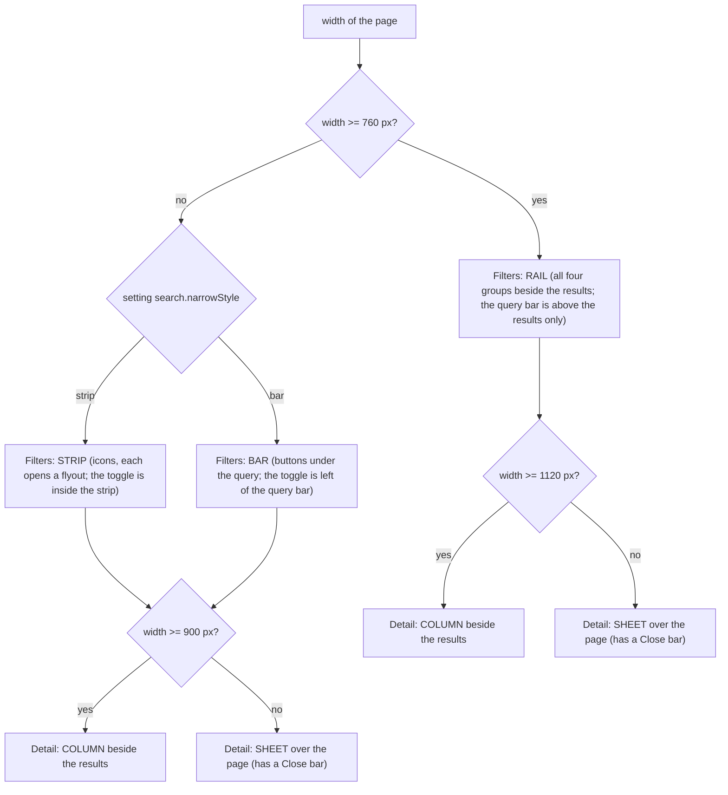
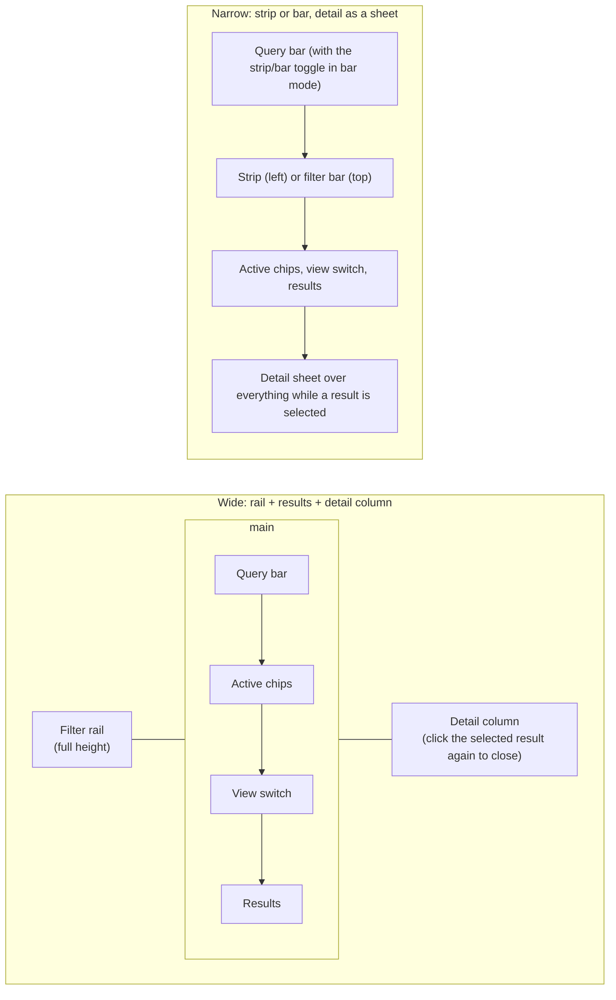

# Search: layout (level 4)

DevTools can be docked to the side, the bottom or undocked, so the page can be wide and short, narrow and tall, or anything between. The shape of the page follows from the **width of its own box**, measured with a `ResizeObserver` (`model/layout.ts`). Only the layout that is in use is mounted.

## The pieces

## Notes

- **Closing the detail.** In the column, clicking the selected result again deselects it (no title bar). In the sheet, which covers the results, there is a Close bar.
- **Same groups, three presentations.** `ScopeFilter`, `SortFilter`, `TypeFilter` and `TagFilter` know nothing about layout. `FilterRail` stacks them, `FilterStrip` and `FilterBar` each put one in a `Popover`.
- **Thresholds** are constants in `model/layout.ts` (`RAIL_MIN_WIDTH`, `DETAIL_MIN_WIDTH_WITH_RAIL`, `DETAIL_MIN_WIDTH`).
- **Row heights are fixed** per row type (state 30 px, passage 54 px), so the virtual list needs no measuring; long text is cut off with an ellipsis, and the detail has the whole text.
