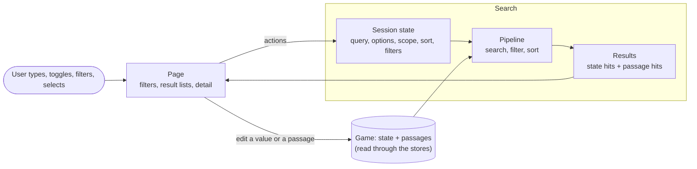

# Search: overview (level 1, the rough picture)

Search takes what the user types plus the data of the game, and shows the matches. Everything else is detail.

## In one paragraph

The page sends the user's actions to a small **session state** (the query, the options, which parts to search in, sorting, filters). A **pipeline** of memos turns that plus the game data into lists of hits: one for the state, one for the passages. The page shows the hits as virtualized rows, with a detail view for the selected one, which can also edit the value or the passage in the game.

## The levels of detail

| Level | Document                                                                                                                                       | Question it answers                                                    |
| ----- | ---------------------------------------------------------------------------------------------------------------------------------------------- | ---------------------------------------------------------------------- |
| 1     | this document                                                                                                                                  | What does Search do?                                                   |
| 2     | [`architecture.md`](./architecture.md)                                                                                                         | Which modules are there, and who depends on whom?                      |
| 3     | [`data-flow.md`](./data-flow.md)                                                                                                               | How does a query become rows, and what re-runs when something changes? |
| 4     | [`keystroke.md`](./keystroke.md), [`layout.md`](./layout.md), [`state-and-settings.md`](./state-and-settings.md), [`details.md`](./details.md) | How does one part work, step by step?                                  |
