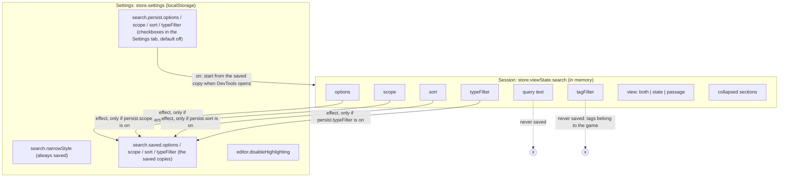

# Search: what is remembered (level 4)

Two kinds of memory: the **session** (in memory while DevTools is open, kept when the user visits another page) and the **settings** (in `localStorage`, kept across restarts).

## Rules

- **The query and the tag filter are never saved.** What is worth filtering by (the tags) belongs to the game, and an old query is more likely a nuisance than a help.
- **What is saved is chosen by the user**, per group, in the Settings tab. Turning a group on saves its current value at once; the saved copy then follows the session.
- **The saved copies are validated** when the settings are read from `localStorage` (the `arktype` schema in `store/store-types.ts`), so a broken or older value falls back to the default.
- **`editor.disableHighlighting`** is not about search, but the detail pane embeds the editor: from which length of passage the syntax highlighting is held back (with a button to turn it on for that passage). Default: 10,000 characters.

## Selection

Which result is open is not saved or stored in the store: it lives in `model/selection.ts`, a signal for the open result plus a store of per-row flags (`"state:<key>"`, `"passage:<id>"`). Selecting another result changes exactly two flags, so exactly two rows update.
